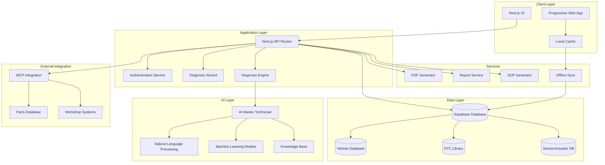

# Design Document: AutoDiag Master AI

## Overview

AutoDiag Master AI is a comprehensive automotive diagnostic web application that leverages artificial intelligence to provide expert-level vehicle troubleshooting and repair guidance. The system acts as a 20-year experienced automotive technician, analyzing vehicle data and symptoms to deliver accurate diagnoses, detailed repair procedures, and comprehensive documentation.

The application builds upon the existing Next.js foundation while integrating advanced AI capabilities, comprehensive Indonesian vehicle databases, complete DTC libraries, and modern cloud infrastructure through Supabase and MCP integration.

## Architecture

### High-Level Architecture



### Technology Stack

**Frontend:**
- Next.js 15 with App Router
- TypeScript for type safety
- Tailwind CSS for styling
- shadcn/ui for components
- React Hook Form for form management
- Zustand for state management

**Backend:**
- Next.js API Routes
- Supabase for database and authentication
- Prisma ORM for database operations
- Node.js runtime

**AI/ML:**
- OpenAI GPT-4 for AI Master Technician
- Custom knowledge base for automotive expertise
- Vector embeddings for semantic search
- Natural language processing for symptom analysis

**Infrastructure:**
- Supabase for database, authentication, and real-time features
- Vercel for deployment and hosting
- MCP (Model Context Protocol) for external integrations
- PDF generation with jsPDF/Puppeteer

## Components and Interfaces

### 1. AI Master Technician Engine

The core AI component that simulates a 20-year experienced automotive technician.

```typescript
interface AIMasterTechnician {
  analyzeDiagnosis(data: DiagnosisData): Promise<DiagnosisResult>
  explainTheory(system: AutomotiveSystem): Promise<TheoryExplanation>
  generateSOP(diagnosis: DiagnosisResult): Promise<SOPDocument>
  provideCostEstimate(repairs: RepairItem[]): Promise<CostEstimate>
}

interface DiagnosisData {
  vehicle: VehicleSpecification
  symptoms: SymptomCollection
  dtcCodes: DTCCode[]
  serviceHistory: ServiceRecord[]
  testResults: TestResult[]
}

interface DiagnosisResult {
  primaryCause: DiagnosticCause
  secondaryCauses: DiagnosticCause[]
  confidence: number
  theoryExplanation: string
  diagnosticSteps: DiagnosticStep[]
  repairProcedures: RepairProcedure[]
  estimatedCost: CostRange
}
```

### 2. Vehicle Database Service

Comprehensive database of Indonesian market vehicles with detailed specifications.

```typescript
interface VehicleDatabase {
  searchVehicles(criteria: SearchCriteria): Promise<Vehicle[]>
  getVehicleDetails(vehicleId: string): Promise<VehicleDetails>
  getEngineSpecs(engineCode: string): Promise<EngineSpecification>
  getCompatibleDTCs(vehicleId: string): Promise<DTCCode[]>
}

interface Vehicle {
  id: string
  brand: string
  model: string
  variant: string
  years: string
  type: VehicleType
  segment: string
  engines: EngineOption[]
  transmissions: TransmissionType[]
  specifications: VehicleSpecs
}

interface EngineSpecification {
  code: string
  displacement: number
  cylinders: number
  fuel: FuelType
  aspiration: AspirationType
  power: number
  torque: number
  commonIssues: string[]
  maintenanceSchedule: MaintenanceItem[]
}
```

### 3. DTC Library Service

Complete diagnostic trouble code library with Indonesian translations and technical details.

```typescript
interface DTCLibrary {
  searchDTCs(query: string): Promise<DTCCode[]>
  getDTCDetails(code: string): Promise<DTCDetails>
  getRelatedSensors(code: string): Promise<Sensor[]>
  getRelatedActuators(code: string): Promise<Actuator[]>
}

interface DTCCode {
  code: string
  system: AutomotiveSystem
  subsystem: string
  description: string
  descriptionIndonesian: string
  severity: SeverityLevel
  symptoms: string[]
  possibleCauses: string[]
  diagnosticSteps: string[]
  repairProcedures: string[]
  relatedComponents: Component[]
  applicableVehicles: string[]
}

interface Sensor {
  id: string
  name: string
  nameIndonesian: string
  type: SensorType
  location: string
  specifications: SensorSpecs
  testingProcedure: TestingProcedure
  expectedValues: ValueRange[]
  wiringDiagram: string
  commonFailures: string[]
}

interface Actuator {
  id: string
  name: string
  nameIndonesian: string
  type: ActuatorType
  location: string
  specifications: ActuatorSpecs
  testingProcedure: TestingProcedure
  operationalParameters: ParameterRange[]
  controlSignals: ControlSignal[]
  commonFailures: string[]
}
```

### 4. Diagnosis Wizard

Progressive data collection system that guides users through comprehensive vehicle diagnosis.

```typescript
interface DiagnosisWizard {
  startNewDiagnosis(): Promise<DiagnosisSession>
  validateStep(step: WizardStep, data: any): Promise<ValidationResult>
  proceedToNextStep(sessionId: string): Promise<WizardStep>
  completeDiagnosis(sessionId: string): Promise<DiagnosisData>
}

interface WizardStep {
  id: string
  title: string
  description: string
  fields: FormField[]
  validation: ValidationRule[]
  isRequired: boolean
  dependsOn?: string[]
}

interface DiagnosisSession {
  id: string
  userId: string
  createdAt: Date
  currentStep: string
  data: Partial<DiagnosisData>
  isComplete: boolean
}
```

### 5. Report Generation Service

Professional diagnostic report generation with PDF export capabilities.

```typescript
interface ReportGenerator {
  generateDiagnosisReport(diagnosis: DiagnosisResult): Promise<DiagnosisReport>
  exportToPDF(report: DiagnosisReport): Promise<Buffer>
  getReportTemplates(): Promise<ReportTemplate[]>
  customizeReport(report: DiagnosisReport, template: ReportTemplate): Promise<DiagnosisReport>
}

interface DiagnosisReport {
  id: string
  vehicleInfo: VehicleInformation
  customerInfo: CustomerInformation
  symptoms: SymptomSummary
  diagnosis: DiagnosisResult
  recommendations: Recommendation[]
  costEstimate: DetailedCostEstimate
  technician: TechnicianInfo
  timestamp: Date
  reportNumber: string
}
```

### 6. MCP Integration Service

Model Context Protocol integration for external automotive systems and databases.

```typescript
interface MCPIntegration {
  connectToPartsDatabase(): Promise<MCPConnection>
  syncWithWorkshopSystem(data: WorkshopData): Promise<SyncResult>
  authenticateExternalSystem(credentials: SystemCredentials): Promise<AuthResult>
  queryExternalDatabase(query: ExternalQuery): Promise<ExternalResult>
}

interface MCPConnection {
  id: string
  systemType: ExternalSystemType
  endpoint: string
  isActive: boolean
  lastSync: Date
  capabilities: string[]
}
```

## Data Models

### Core Data Structures

```typescript
// Vehicle and Engine Models
interface VehicleSpecification {
  brand: string
  model: string
  year: number
  engineCode: string
  transmission: TransmissionType
  mileage: number
  vin?: string
  modifications: Modification[]
}

interface EngineOption {
  code: string
  displacement: number
  cylinders: number
  fuel: 'Bensin' | 'Diesel' | 'Hybrid' | 'Electric'
  aspiration: 'Natural' | 'Turbo' | 'Supercharged'
  power: number
  torque: number
  commonVehicles: string[]
}

// Symptom and Diagnosis Models
interface SymptomCollection {
  primaryComplaint: string
  sounds: string[]
  vibrations: string[]
  smells: string[]
  warningLights: string[]
  conditions: string[]
  additionalNotes?: string
}

interface DiagnosticCause {
  component: string
  probability: number
  description: string
  symptoms: string[]
  testingRequired: string[]
  repairComplexity: ComplexityLevel
  estimatedCost: CostRange
}

// Service and Maintenance Models
interface ServiceRecord {
  date: Date
  mileage: number
  serviceType: ServiceType
  partsReplaced: string[]
  laborHours: number
  cost: number
  notes?: string
}

interface RepairProcedure {
  id: string
  title: string
  description: string
  steps: RepairStep[]
  requiredTools: Tool[]
  requiredParts: Part[]
  estimatedTime: number
  difficultyLevel: DifficultyLevel
  safetyPrecautions: string[]
  qualityChecks: QualityCheck[]
}

// Database Schema Models
interface DatabaseSchema {
  vehicles: VehicleTable
  engines: EngineTable
  dtcCodes: DTCTable
  sensors: SensorTable
  actuators: ActuatorTable
  diagnoses: DiagnosisTable
  reports: ReportTable
  users: UserTable
}
```

### Supabase Database Schema

```sql
-- Vehicles table
CREATE TABLE vehicles (
  id UUID PRIMARY KEY DEFAULT gen_random_uuid(),
  brand VARCHAR(50) NOT NULL,
  model VARCHAR(100) NOT NULL,
  variant VARCHAR(100),
  years VARCHAR(20) NOT NULL,
  type vehicle_type NOT NULL,
  segment VARCHAR(50),
  created_at TIMESTAMP DEFAULT NOW(),
  updated_at TIMESTAMP DEFAULT NOW()
);

-- Engines table
CREATE TABLE engines (
  id UUID PRIMARY KEY DEFAULT gen_random_uuid(),
  code VARCHAR(20) NOT NULL UNIQUE,
  brand VARCHAR(50) NOT NULL,
  displacement INTEGER NOT NULL,
  cylinders INTEGER NOT NULL,
  fuel fuel_type NOT NULL,
  aspiration aspiration_type NOT NULL,
  power INTEGER NOT NULL,
  torque INTEGER NOT NULL,
  common_vehicles TEXT[],
  created_at TIMESTAMP DEFAULT NOW()
);

-- DTC Codes table
CREATE TABLE dtc_codes (
  id UUID PRIMARY KEY DEFAULT gen_random_uuid(),
  code VARCHAR(10) NOT NULL UNIQUE,
  system automotive_system NOT NULL,
  subsystem VARCHAR(100),
  description TEXT NOT NULL,
  description_indonesian TEXT NOT NULL,
  severity severity_level NOT NULL,
  symptoms TEXT[],
  possible_causes TEXT[],
  diagnostic_steps TEXT[],
  repair_procedures TEXT[],
  applicable_vehicles UUID[],
  created_at TIMESTAMP DEFAULT NOW()
);

-- Sensors table
CREATE TABLE sensors (
  id UUID PRIMARY KEY DEFAULT gen_random_uuid(),
  name VARCHAR(100) NOT NULL,
  name_indonesian VARCHAR(100) NOT NULL,
  type sensor_type NOT NULL,
  location TEXT,
  specifications JSONB,
  testing_procedure TEXT,
  expected_values JSONB,
  wiring_diagram_url TEXT,
  common_failures TEXT[],
  related_dtc_codes UUID[],
  created_at TIMESTAMP DEFAULT NOW()
);

-- Diagnoses table
CREATE TABLE diagnoses (
  id UUID PRIMARY KEY DEFAULT gen_random_uuid(),
  user_id UUID REFERENCES auth.users(id),
  vehicle_data JSONB NOT NULL,
  symptoms JSONB NOT NULL,
  dtc_codes TEXT[],
  diagnosis_result JSONB NOT NULL,
  ai_confidence DECIMAL(3,2),
  estimated_cost JSONB,
  status diagnosis_status DEFAULT 'pending',
  created_at TIMESTAMP DEFAULT NOW(),
  updated_at TIMESTAMP DEFAULT NOW()
);

-- Reports table
CREATE TABLE reports (
  id UUID PRIMARY KEY DEFAULT gen_random_uuid(),
  diagnosis_id UUID REFERENCES diagnoses(id),
  report_number VARCHAR(20) UNIQUE NOT NULL,
  customer_info JSONB,
  technician_info JSONB,
  report_data JSONB NOT NULL,
  pdf_url TEXT,
  template_used VARCHAR(50),
  created_at TIMESTAMP DEFAULT NOW()
);
```

## Correctness Properties

*A property is a characteristic or behavior that should hold true across all valid executions of a system-essentially, a formal statement about what the system should do. Properties serve as the bridge between human-readable specifications and machine-verifiable correctness guarantees.*

Based on the prework analysis, the following correctness properties ensure the system meets its requirements:

### Property 1: AI Master Technician Analysis Consistency
*For any* valid vehicle data and symptom combination, when submitted to the AI Master Technician, the analysis should follow established automotive diagnostic patterns and include theoretical explanations
**Validates: Requirements 1.1, 1.2, 1.3**

### Property 2: Vehicle Database Completeness
*For any* vehicle selection request, the Vehicle Database should return complete technical specifications including engine details, transmission types, and compatible DTC codes
**Validates: Requirements 2.2, 2.3, 2.5**

### Property 3: DTC Library Indonesian Localization
*For any* DTC code lookup, the system should provide descriptions in Indonesian language with complete sensor and actuator relationships
**Validates: Requirements 3.2, 3.3, 3.4**

### Property 4: Sensor and Actuator Information Completeness
*For any* DTC code with related components, the system should display complete sensor and actuator specifications including testing procedures and expected values
**Validates: Requirements 4.1, 4.2, 4.3, 4.4, 4.5**

### Property 5: Diagnosis Wizard Data Validation
*For any* wizard step progression, the system should validate data completeness and prevent advancement with incomplete required information
**Validates: Requirements 5.1, 5.2, 5.3, 5.4, 5.5**

### Property 6: Diagnosis Engine Processing Completeness
*For any* diagnosis request, the engine should process all input data types and generate ranked causes with theoretical explanations and diagnostic procedures
**Validates: Requirements 6.1, 6.2, 6.3, 6.4, 6.5**

### Property 7: SOP Generation Completeness
*For any* confirmed diagnosis, the SOP Generator should create detailed procedures including tools, parts, safety precautions, and quality checkpoints
**Validates: Requirements 7.1, 7.2, 7.3, 7.4, 7.5**

### Property 8: Report Generation Completeness
*For any* completed diagnosis, the Report Generator should create comprehensive reports with all required sections and support PDF export
**Validates: Requirements 8.1, 8.2, 8.3, 8.4, 8.5**

### Property 9: Data Persistence and Retrieval
*For any* diagnostic session completion, the system should store all data permanently and support search and retrieval of historical diagnoses
**Validates: Requirements 9.1, 9.2, 9.3, 9.4**

### Property 10: MCP Integration Data Consistency
*For any* external system integration, the MCP service should maintain data consistency and support secure authentication
**Validates: Requirements 10.1, 10.2, 10.3, 10.4, 10.5**

### Property 11: Responsive UI Functionality
*For any* device type (desktop, tablet, mobile), the user interface should provide appropriate responsive behavior and touch-friendly controls
**Validates: Requirements 11.1, 11.2, 11.4, 11.5**

### Property 12: Indonesian Language Consistency
*For any* system output, the content should be primarily in Indonesian with consistent automotive terminology and proper localization formatting
**Validates: Requirements 12.1, 12.2, 12.3, 12.4, 12.5**

### Property 13: Security and Authentication
*For any* system access attempt, proper authentication should be required and all data should be encrypted with appropriate access controls
**Validates: Requirements 14.1, 14.2, 14.3, 14.4, 14.5**

### Property 14: Offline Functionality and Synchronization
*For any* offline operation, the system should cache essential data locally and synchronize properly when connectivity returns
**Validates: Requirements 15.1, 15.2, 15.3, 15.4, 15.5**

## Error Handling

### Error Categories and Handling Strategies

**1. AI Processing Errors**
- Timeout handling for AI analysis requests
- Fallback to cached diagnostic patterns
- Graceful degradation with manual diagnostic options
- Error logging and monitoring for AI service issues

**2. Database Connection Errors**
- Automatic retry mechanisms with exponential backoff
- Offline mode activation when Supabase is unavailable
- Local cache utilization for essential data
- User notification of connectivity issues

**3. Data Validation Errors**
- Client-side validation with immediate feedback
- Server-side validation with detailed error messages
- Input sanitization and type checking
- Graceful handling of malformed data

**4. External Integration Errors**
- MCP connection failure handling
- Parts database synchronization errors
- Workshop system integration timeouts
- Fallback to local data when external systems fail

**5. PDF Generation Errors**
- Alternative report formats when PDF fails
- Retry mechanisms for temporary failures
- Error reporting to users with alternative options
- Logging for debugging PDF generation issues

### Error Recovery Mechanisms

```typescript
interface ErrorHandler {
  handleAITimeout(request: DiagnosisRequest): Promise<DiagnosisResult>
  handleDatabaseError(operation: DatabaseOperation): Promise<OperationResult>
  handleValidationError(data: any, rules: ValidationRule[]): ValidationResult
  handleExternalServiceError(service: ExternalService): Promise<ServiceResult>
}

interface ErrorRecovery {
  retryWithBackoff(operation: () => Promise<any>, maxRetries: number): Promise<any>
  fallbackToCache(key: string): Promise<any>
  activateOfflineMode(): void
  notifyUser(error: UserFacingError): void
}
```

## Testing Strategy

### Dual Testing Approach

The system employs both unit testing and property-based testing to ensure comprehensive coverage:

**Unit Tests:**
- Specific examples and edge cases
- Integration points between components
- Error conditions and boundary cases
- UI component behavior and interactions

**Property-Based Tests:**
- Universal properties across all inputs
- Comprehensive input coverage through randomization
- System behavior validation under various conditions
- Data consistency and integrity verification

### Property-Based Testing Configuration

**Testing Framework:** fast-check for TypeScript/JavaScript property-based testing
**Test Configuration:** Minimum 100 iterations per property test
**Test Tagging:** Each property test references its design document property

Example property test structure:
```typescript
// Feature: automotive-diagnostic-ai, Property 1: AI Master Technician Analysis Consistency
describe('AI Master Technician Analysis', () => {
  it('should provide consistent analysis with theoretical explanations', 
    fc.asyncProperty(
      vehicleDataArbitrary,
      symptomCollectionArbitrary,
      async (vehicleData, symptoms) => {
        const result = await aiMasterTechnician.analyzeDiagnosis({
          vehicle: vehicleData,
          symptoms: symptoms,
          dtcCodes: [],
          serviceHistory: [],
          testResults: []
        });
        
        // Verify analysis follows automotive patterns
        expect(result.theoryExplanation).toBeDefined();
        expect(result.theoryExplanation.length).toBeGreaterThan(50);
        expect(result.primaryCause).toBeDefined();
        expect(result.confidence).toBeGreaterThan(0);
        expect(result.diagnosticSteps.length).toBeGreaterThan(0);
      }
    )
  );
});
```

### Testing Categories

**1. AI and ML Testing**
- Model output consistency and quality
- Response time and performance
- Knowledge base accuracy
- Language and terminology validation

**2. Database Testing**
- Data integrity and relationships
- Query performance and optimization
- Backup and recovery procedures
- Migration and schema changes

**3. Integration Testing**
- MCP external system connections
- Supabase real-time features
- PDF generation and export
- Offline synchronization

**4. UI/UX Testing**
- Responsive design across devices
- Accessibility compliance
- User workflow validation
- Performance and loading times

**5. Security Testing**
- Authentication and authorization
- Data encryption validation
- Input sanitization
- Privacy compliance features